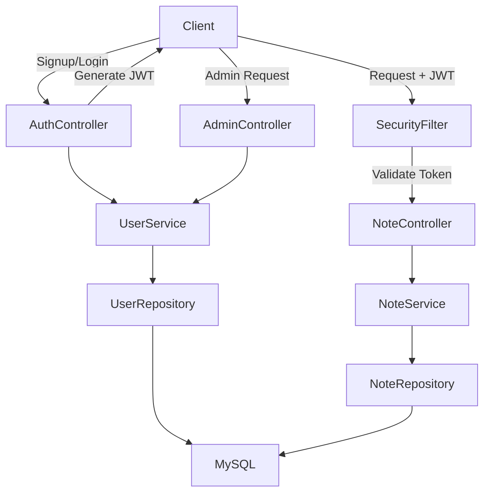
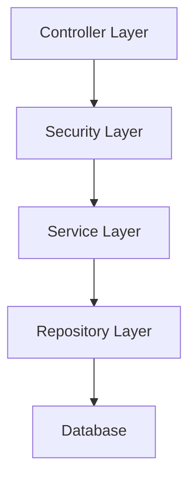

# 🛡️ Incrypt – Secure Notes Backend Application

**Incrypt** is a secure, backend-driven notes management system focused on authentication security, data protection, and clean architectural design.

The application enables users to create, manage, and securely access personal notes through a stateless JWT-based authentication mechanism. 

It is built following production-grade backend development practices using **Spring Boot**, **Spring Security**, and **MySQL**.

---

## Overview

**Incrypt** demonstrates:

* Stateless authentication using `JWT`

* `Role-based` authorization (USER / ADMIN)

* Secure password storage with `BCrypt`

* User-scoped data isolation

* Layered architecture following `SOLID` principles

* Production-ready backend configuration

---


## Application Flow



---

## Core Features

### 1. Authentication & Authorization

#### User Registration

* Unique username and email enforcement
* Email validation
* BCrypt password hashing
* Default role assignment (ROLE_USER)

#### User Login

* Credential validation
* JWT token generation
* 48-hour token validity
* Stateless session management

#### JWT Management

* Secure token generation with secret key
* Bearer token extraction
* Request-level token validation
* Custom authentication filter integration

#### Role-Based Access Control (RBAC)

* ROLE_USER: Note management access
* ROLE_ADMIN: Platform management access
* Method-level authorization (`@PreAuthorize`)
* Endpoint-level protection

---

### 2. Notes Management

* Create notes (authenticated users only)
* Retrieve all notes for logged-in user
* Update notes (ownership enforced)
* Delete notes (ownership enforced)
* Strict user-level data isolation

---

### 3. Admin Capabilities

* View all registered users
* Retrieve user details by ID
* Update user roles
* Admin-only endpoint protection

---

### 4. Security Implementation

* BCrypt password hashing
* CSRF protection with cookie-based tokens
* Custom JWT authentication filter
* Unauthorized access handling (401)
* Access denied handling (403)
* CORS configuration
* Structured exception handling

---

## API Endpoints

### Public

| Method | Endpoint                  | Description         |
| ------ | ------------------------- | ------------------- |
| POST   | `/api/auth/public/signup` | Register new user   |
| POST   | `/api/auth/public/login`  | Authenticate user   |
| GET    | `/api/csrf-token`         | Retrieve CSRF token |

### Authenticated (ROLE_USER)

| Method | Endpoint          | Description    |
| ------ | ----------------- | -------------- |
| POST   | `/api/notes`      | Create note    |
| GET    | `/api/notes`      | Get user notes |
| PUT    | `/api/notes/{id}` | Update note    |
| DELETE | `/api/notes/{id}` | Delete note    |

### Admin (ROLE_ADMIN)

| Method | Endpoint                | Description      |
| ------ | ----------------------- | ---------------- |
| GET    | `/api/admin/getUsers`   | List all users   |
| GET    | `/api/admin/user/{id}`  | Get user details |
| PUT    | `/api/admin/updateRole` | Update user role |

---

## Technology Stack

| Layer          | Technology         |
| -------------- | ------------------ |
| Language       | Java 21            |
| Framework      | Spring Boot 4.x    |
| Security       | Spring Security    |
| Authentication | JWT                |
| ORM            | JPA / Hibernate    |
| Database       | MySQL              |
| Build Tool     | Maven              |
| Validation     | Jakarta Validation |

---

## Layered Architecture



---

## Project Structure

```
com.incrypt
 ├── controller
 ├── service
 ├── repository
 ├── model
 ├── security
 ├── config
 └── exception
```

---

## Getting Started

### Prerequisites

* Java 21+
* Maven 3.6+
* MySQL 8+

---

### Setup Instructions

1. Clone the repository

   ```bash
   git clone <git@github.com:BenGJ10/Inkrypt.git>
   cd Incrypt
   ```

2. Configure database credentials
   Update `application.properties` with your MySQL configuration.

3. Build the project

   ```bash
   mvn clean install
   ```

4. Run the application

   ```bash
   mvn spring-boot:run
   ```

5. Test using Postman or any API client:

   * Register a user
   * Login to receive JWT
   * Access protected endpoints using Bearer token

---

## Design Principles Applied

* Stateless backend design

* Secure authentication flow

* Clear separation of concerns

* Ownership-based data access

* Production-ready security configuration

* Clean exception handling strategy

---

## Scalability Considerations

### 1. Stateless Design

Because authentication is token-based and sessionless:

- The application can scale horizontally behind a load balancer.

- No sticky sessions required.

- Easily deployable in containerized environments (Docker, Kubernetes).

### 2. Separation of Concerns

Clear boundaries between:

- Authentication logic

- Authorization logic

- Business logic

- Data access

This allows:

- Independent refactoring

- Easier testing

- Modular scaling

### 3. Database Optimization Readiness

- Relational integrity via foreign keys

- Suitable for indexing on user_id and note_id

- Designed for read/write optimization

- Compatible with connection pooling

### 4. Cloud Deployment Ready

Architecture supports:

- Deployment behind reverse proxies

- Environment-based configuration

- Externalized secrets

- Migration to managed databases (RDS, Cloud SQL)

---

## Conclusion

🛡️ **Incrypt** is a secure, scalable, and well-architected backend application for managing personal notes. 

It demonstrates best practices in authentication, authorization, and data protection while adhering to clean code principles and production-ready configurations.

---