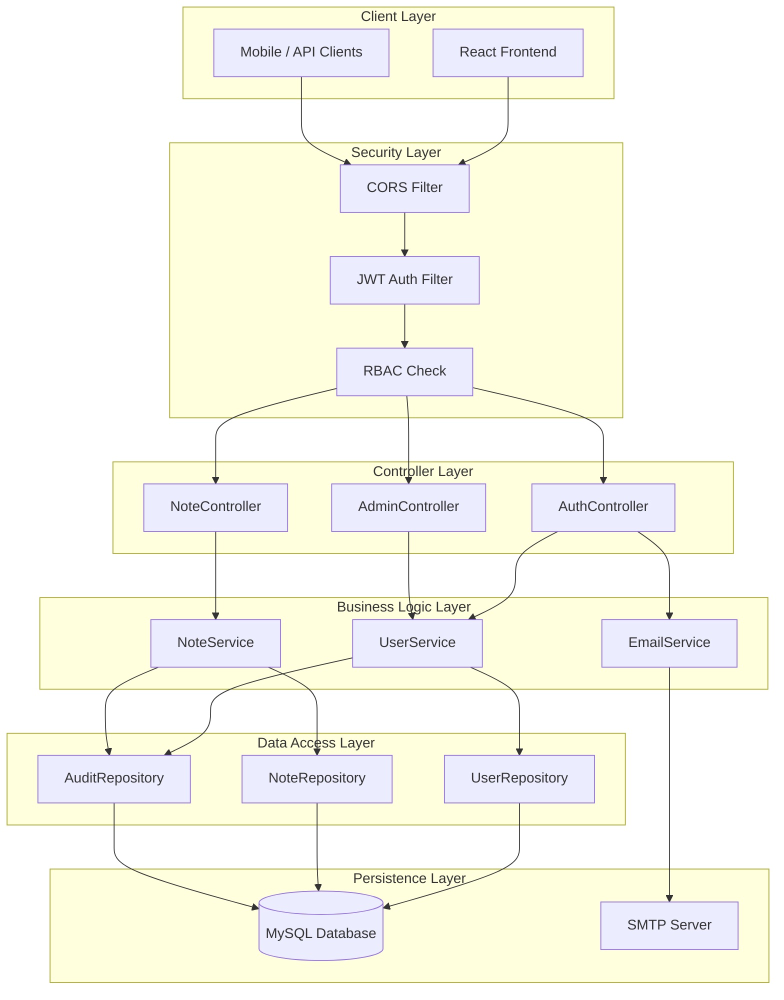
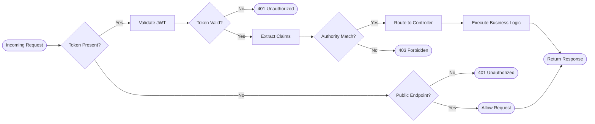
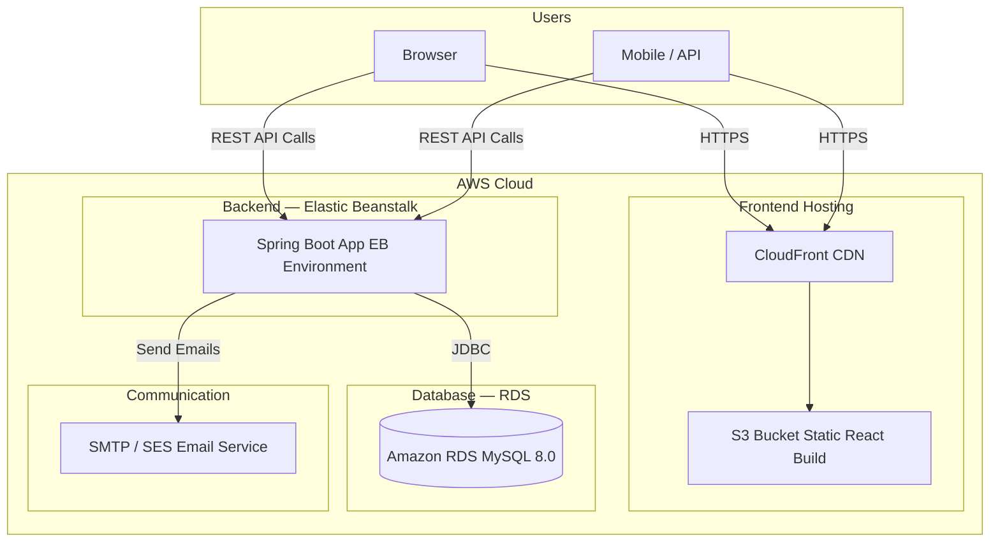
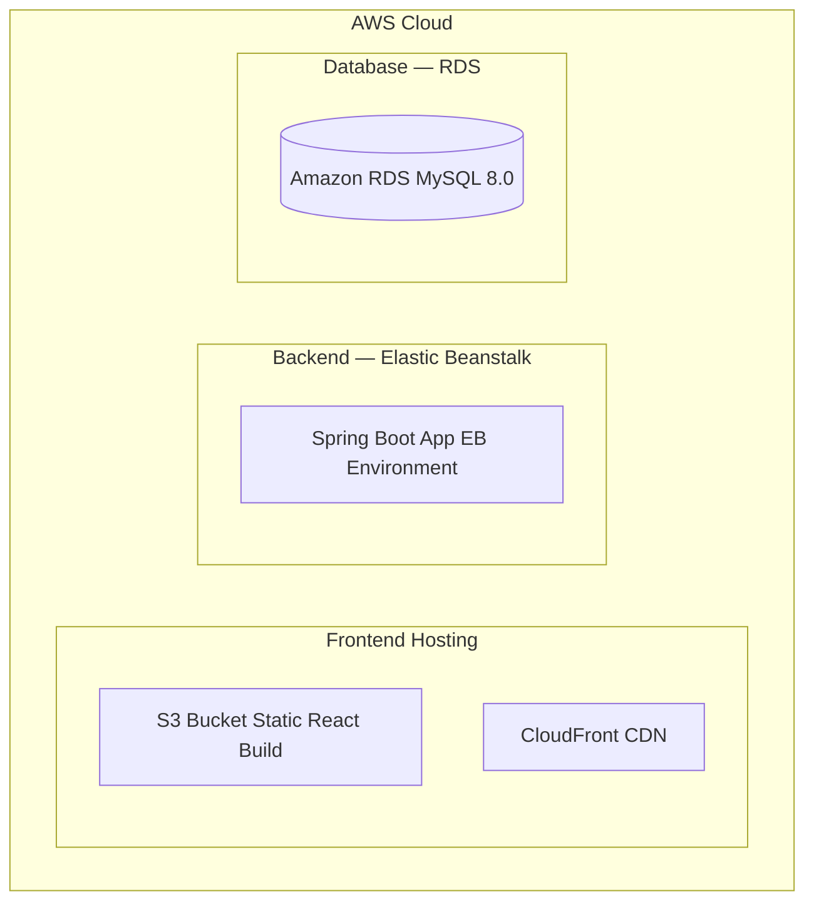

<div align="center">

# 🖋️ Incrypt

### Secure Notes Management Platform

A full-stack, production-ready **secure notes application** with enterprise-grade JWT authentication, role-based access control, and complete user data isolation.

[](https://openjdk.org/)
[](https://spring.io/projects/spring-boot)
[](https://reactjs.org/)
[](https://mysql.com/)
[](https://docker.com/)
[](https://aws.amazon.com/)
[](LICENSE)

[Features](#features) · [Architecture](#architecture) · [API Reference](#api-reference) · [Getting Started](#getting-started) · [Deployment](#deployment)

</div>

---

## Overview

**Incrypt** is a secure, scalable notes management platform built with a **Spring Boot 4.0** backend and a **React** frontend. It demonstrates enterprise development practices including stateless JWT authentication, role-based authorization, BCrypt password hashing, and strict user-scoped data isolation — all packaged for containerized deployment via Docker.

---

## Features

### Authentication & Security
- **Stateless JWT authentication** with 48-hour token validity
- **BCrypt password hashing** (12 rounds)
- **Role-based access control** — `ROLE_USER` and `ROLE_ADMIN`
- Method-level authorization via `@PreAuthorize`
- CSRF protection and CORS configuration for trusted origins

### Notes Management
- Create, read, update, and delete personal notes (authenticated users only)
- Rich text editor powered by React Quill
- Paginated responses with strict user-scoped data isolation
- Ownership verification enforced on all mutating operations

### Admin Dashboard
- View and manage all registered users
- Update user roles and retrieve detailed user profiles
- Access structured audit logs for system activity monitoring

### User Profile
- Update username (with uniqueness validation) and password
- View profile information with detailed error feedback

### Contact & Communication
- Public contact form with email delivery via SMTP/TLS
- Structured email templates and team inbox routing

---

## Architecture

### System Overview



### Authentication Flow



### AWS Infrastructure



---

## Technology Stack

### Backend

| Component      | Technology         | Version |
|----------------|--------------------|---------|
| Language       | Java               | 21 LTS  |
| Framework      | Spring Boot        | 4.0.2   |
| Security       | Spring Security    | 6.x     |
| Authentication | JWT (JJWT)         | 0.11.x  |
| ORM            | Hibernate / JPA    | 6.x     |
| Database       | MySQL              | 8.0+    |
| Build Tool     | Maven              | 3.6+    |
| Validation     | Jakarta Validation | 3.x     |

### Frontend

| Component      | Technology         | Version  |
|----------------|--------------------|----------|
| UI Library     | React              | 18.3.1   |
| Routing        | React Router DOM   | 6.23.1   |
| UI Components  | Material-UI (MUI)  | 5.15.19  |
| HTTP Client    | Axios              | 1.7.0    |
| Forms          | React Hook Form    | 7.51.5   |
| Rich Editor    | React Quill        | 2.0.0    |
| Notifications  | React Hot Toast    | 2.4.1    |
| Animations     | Framer Motion      | 11.2.10  |
| State          | React Context API  | Built-in |

### Infrastructure

| Component        | Technology                  |
|------------------|-----------------------------|
| Containerization | Docker + Docker Compose     |
| Cloud Platform   | Amazon Web Services (AWS)   |
| Backend Hosting  | AWS Elastic Beanstalk       |
| Database         | Amazon RDS (MySQL 8.0+)     |
| Frontend Hosting | AWS S3 + CloudFront         |
| Email            | SMTP with TLS/StartTLS      |

---

## API Reference

### Public Endpoints

| Method | Endpoint                    | Description           | Body                          |
|--------|-----------------------------|-----------------------|-------------------------------|
| `POST` | `/api/auth/public/signup`   | Register a new user   | `username`, `email`, `password` |
| `POST` | `/api/auth/public/login`    | Authenticate user     | `username`, `password`        |
| `POST` | `/api/auth/public/contact`  | Submit contact form   | `name`, `email`, `message`    |
| `GET`  | `/api/csrf-token`           | Retrieve CSRF token   | —                             |

### Authenticated Endpoints — `ROLE_USER`

| Method   | Endpoint                        | Description              | Notes                    |
|----------|---------------------------------|--------------------------|--------------------------|
| `POST`   | `/api/notes`                    | Create a note            | `title`, `content`       |
| `GET`    | `/api/notes`                    | Retrieve user's notes    | Paginated, user-scoped   |
| `PUT`    | `/api/notes/{id}`               | Update a note            | Ownership verified       |
| `DELETE` | `/api/notes/{id}`               | Delete a note            | Ownership verified       |
| `POST`   | `/api/auth/update-credentials`  | Update profile           | `username`, `password`   |
| `GET`    | `/api/auth/user/profile`        | Get current user profile | —                        |

### Admin Endpoints — `ROLE_ADMIN`

| Method | Endpoint                  | Description             | Notes     |
|--------|---------------------------|-------------------------|-----------|
| `GET`  | `/api/admin/getUsers`     | List all users          | Paginated |
| `GET`  | `/api/admin/user/{id}`    | Get user by ID          | Full profile |
| `PUT`  | `/api/admin/updateRole`   | Update a user's role    | `userId`, `role` |
| `GET`  | `/api/admin/audit-logs`   | View system audit logs  | —         |

---

## Project Structure

```
src/main/java/com/bengregory/incrypt/
├── controller/             # REST API layer
│   ├── AuthController
│   ├── NoteController
│   └── AdminController
├── service/                # Business logic layer
│   ├── UserService
│   ├── NoteService
│   └── EmailService
├── repository/             # Data access layer
│   ├── UserRepository
│   ├── NoteRepository
│   └── AuditRepository
├── model/                  # JPA entities
├── security/               # JWT filter, config
├── config/                 # Spring configuration
└── exception/              # Global exception handling

incrypt-react/              # React frontend
├── src/
│   ├── components/
│   ├── pages/
│   ├── context/
│   └── services/
└── public/
```

---

## Getting Started

### Prerequisites

**Backend**
- Java 21 JDK+
- Maven 3.6+
- MySQL 8.0+

**Frontend**
- Node.js 16+ and npm 8+

**Container Deployment**
- Docker 20.10+
- Docker Compose 1.29+

---

### Backend Setup

1. **Clone the repository**

   ```bash
   git clone https://github.com/BenGJ10/Incrypt.git
   cd Incrypt
   ```

2. **Configure `application.properties`**

   ```properties
   # Database
   spring.datasource.url=jdbc:mysql://localhost:3306/secure_notes_db
   spring.datasource.username=springuser
   spring.datasource.password=spring@password
   spring.jpa.hibernate.ddl-auto=update

   # JWT
   incrypt.app.jwtSecret=your-secret-key-here
   incrypt.app.jwtExpirationMs=172800000

   # Email
   spring.mail.host=smtp.gmail.com
   spring.mail.port=587
   spring.mail.username=your-email@gmail.com
   spring.mail.password=your-app-password
   contact.team.email=team@incrypt.com
   ```

3. **Build and run**

   ```bash
   mvn clean install
   mvn spring-boot:run
   ```

   The backend will start at `http://localhost:8080`.

---

### Frontend Setup

1. **Navigate to the frontend directory**

   ```bash
   cd incrypt-react
   ```

2. **Install dependencies and start the dev server**

   ```bash
   npm install
   npm start
   ```

   The frontend will run at `http://localhost:3000`.

---

## Deployment

### AWS (Production)

Incrypt's production infrastructure runs entirely on AWS:



| Service | AWS Component | Purpose |
|---------|---------------|---------|
| Frontend | S3 + CloudFront | Static React build, global CDN delivery |
| Backend  | Elastic Beanstalk | Auto-scaling Spring Boot environment |
| Database | RDS (MySQL 8.0) | Managed relational database with automated backups |

**Frontend — S3 + CloudFront**

```bash
# Build the React app
cd incrypt-react
npm run build

# Sync build output to your S3 bucket
aws s3 sync build/ s3://your-bucket-name --delete

# Invalidate CloudFront cache after deploy
aws cloudfront create-invalidation \
  --distribution-id YOUR_DISTRIBUTION_ID \
  --paths "/*"
```

**Backend — Elastic Beanstalk**

```bash
# Package the Spring Boot JAR
mvn clean package -DskipTests

# Deploy to Elastic Beanstalk
eb init incrypt --platform java
eb create incrypt-prod
eb deploy
```

Set the following environment variables in your Elastic Beanstalk environment configuration:

| Variable               | Required | Description                        |
|------------------------|----------|------------------------------------|
| `DB_URL`               | ✅       | RDS JDBC connection string         |
| `DB_USER`              | ✅       | RDS database username              |
| `DB_PASSWORD`          | ✅       | RDS database password              |
| `JWT_SECRET`           | ✅       | JWT signing key                    |
| `JWT_EXPIRATION_MS`    | ❌       | Token expiry in ms (default 172800000) |
| `MAIL_HOST`            | ❌       | SMTP server host                   |
| `MAIL_PORT`            | ❌       | SMTP server port                   |
| `CONTACT_TEAM_EMAIL`   | ❌       | Team notification inbox            |
| `REACT_APP_API_BASE_URL` | ❌     | Beanstalk environment URL          |

---

### Docker (Local / Self-Hosted)

Build and start all services with a single command:

```bash
docker-compose up --build
```

| Service  | URL                      |
|----------|--------------------------|
| Backend  | `http://localhost:8080`  |
| Database | `localhost:3306`         |

```bash
# View logs
docker-compose logs -f app

# Stop all services
docker-compose down
```

---

## Scalability

Incrypt is designed with horizontal scaling in mind:

- **Stateless architecture** — no sticky sessions; scales horizontally behind Elastic Beanstalk's load balancer

- **Managed infrastructure** — RDS handles automated backups, failover, and read replica support

- **Global CDN** — CloudFront serves the React frontend from edge locations worldwide

- **Container-friendly** — Docker image compatible with ECS, Kubernetes, or any container runtime

- **Database optimized** — relational integrity with foreign keys, indexed on `user_id` and `note_id`, connection pooling ready

---

## Security Summary

| Feature                    | Implementation                          |
|----------------------------|-----------------------------------------|
| Password storage           | BCrypt (12 rounds)                      |
| Authentication             | Stateless JWT (Bearer tokens)           |
| Token validity             | 48 hours (configurable)                 |
| Authorization              | RBAC with `@PreAuthorize`               |
| Data isolation             | User-scoped at repository level         |
| CSRF                       | Token-based CSRF protection             |
| Email transport            | SMTP with TLS/StartTLS                  |
| Error handling             | No sensitive data in error messages     |

---

## Contributing

Contributions are welcome. Please open an issue to discuss proposed changes before submitting a pull request.

1. Fork the repository
2. Create a feature branch (`git checkout -b feature/your-feature`)
3. Commit your changes (`git commit -m 'Add your feature'`)
4. Push to the branch (`git push origin feature/your-feature`)
5. Open a Pull Request

---

## License

This project is licensed under the [MIT License](LICENSE).

---

<div align="center">
  <sub>Built with ☕ using Spring Boot & React</sub>
</div>
